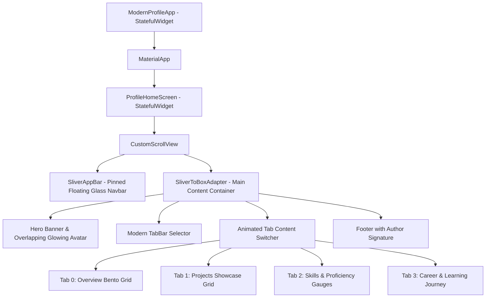

# 📖 Technical Project Documentation

**Project Name**: Sahil Pandey - Flutter Developer Portfolio & Profile App  
**Author**: Sahil Pandey  
**Version**: `1.0.0+1`  
**Platform**: Cross-Platform (Web, Mobile iOS/Android, Desktop macOS/Windows/Linux)  
**Framework**: Flutter 3.x with Dart 3.x (Material 3)

---

## 1. Executive Summary

This project is a high-performance, responsive Flutter portfolio and interactive profile application. It serves as an interactive resume and showcase for **Sahil Pandey**, a Junior Flutter Developer. The UI was designed from scratch to replace generic template layouts with a luxury, modern aesthetic featuring **Gold (`#FFD700`)**, **Wheat (`#F5DEB3`)**, and **Ghost White (`#F8F8FF`)** tones, complete with interactive state features and dark/light mode support.

---

## 2. Design System & Theme Tokens

### 2.1 Color Palette Specifications
| Color Name | Hex Code | Visual Preview / Description | Usage in App |
|---|---|---|---|
| **Gold** | `#FFD700` | Bright radiant gold | Header mesh gradient, avatar glow ring, badges |
| **Deep Gold / Bronze** | `#D97706` / `#B45309` | High-contrast warm amber | Primary CTA buttons, interactive icons, active tab highlights |
| **Wheat** | `#F5DEB3` | Soft warm cream beige | Card borders, subtle divider lines, tab background |
| **Ghost White** | `#F8F8FF` | Pristine clean off-white | Base scaffold background, input fields in light mode |
| **Midnight Charcoal** | `#121214` | Deep rich dark background | Scaffold background in dark mode |
| **Surface Card Dark** | `#1E1E24` | Elevated dark container surface | Bento cards & panels in dark mode |

### 2.2 Typography Hierarchy
- **Brand Title (`SP.`)**: Font size `20px`, `FontWeight.w900`, `letterSpacing: 1.2`
- **Hero Profile Name**: Font size `26px`, `FontWeight.w800`, `letterSpacing: -0.5`
- **Section Headers**: Font size `17px`, `FontWeight.w700`
- **KPI Stat Values**: Font size `22px`, `FontWeight.w800`
- **Body & Bio Copy**: Font size `14px`, line height `1.65`, crisp contrast colors

---

## 3. Architecture & Widget Hierarchy



### 3.1 State Management Overview
- **`_isDarkMode`**: Controls dynamic toggle between `ThemeMode.light` and `ThemeMode.dark`.
- **`_tabController`**: SingleTickerProvider tab controller managing smooth animated transitions between the 4 content views.
- **`_isConnected` & `_followersCount`**: Interactive state for user connections with real-time increment/decrement and toast notifications.
- **Clipboard API**: Integrated with `Clipboard.setData()` for instant one-tap copy of `sahilpandey.dev@gmail.com`.

---

## 4. Key Modules & Features

### 4.1 Hero Header Module (`_buildHeroCard`)
- **Cover Banner**: Triple-gradient header with circular abstract ambient mesh patterns.
- **Overlapping Avatar**: Floating offset circle with glowing gradient border (`#FFD700` to `#D97706`) and verified badge.
- **Role Tags**: "DEV" status badge, B.Tech CSE tag, and fast learner indicator.
- **Action CTAs**: Quick "Message" note modal and "Connect" button.

### 4.2 Tab 1: Bento Grid Overview (`_buildOverviewTab`)
- **4 Metric Cards**: Projects Built (`12+`), Connections (`850`), Code Rating (`4.8/5.0`), Dedication (`100%`).
- **Biography Card**: Concise summary of Sahil's skills, motivation, and technology tags.
- **Contact Dock**: Clickable rows for Email, Portfolio Website, and LinkedIn profile.
- **Development Focus**: Architectural pillars (Clean State, REST APIs, Pixel-Perfect UI).
- **Hire Me Card**: Direct inquiry banner with one-click note submission.

### 4.3 Tab 2: Projects Showcase (`_buildProjectsTab`)
- **Adaptive Grid**: 2-column on desktop/tablets, single-column on mobile devices.
- **Curated Projects**:
  1. **QuickShop E-Commerce** (Flutter, Provider, REST API, SharedPrefs)
  2. **SkyCast Weather App** (Flutter, OpenWeather API, Geolocator, Charts)
  3. **TaskFlow Productivity** (Flutter, SQLite, Local Notifications, Dart)
  4. **ChatSphere Messenger** (Flutter, Firebase Auth, Firestore, Storage)

### 4.4 Tab 3: Technical Skills (`_buildSkillsTab`)
- **Core Mobile & Languages**: Flutter Widgets (88%), Dart OOP (85%), Provider/Riverpod (82%), Responsive UI (86%).
- **Backend & Cloud**: Firebase (80%), REST APIs (84%), SQLite (78%), Git Version Control (85%).
- **Design & Best Practices**: Figma translation (88%), Clean Architecture (84%), Material Design 3 (85%).

### 4.5 Tab 4: Journey & Timeline (`_buildExperienceTab`)
- **Vertical Milestones**: Custom timeline nodes connected by wheat/charcoal connector lines.
- **Milestones Included**:
  - Junior Flutter Developer (Freelance & Personal Projects - 2024 to Present)
  - Flutter & Mobile Development Trainee (2023 - 2024)
  - Bachelor of Technology in Computer Science (2020 - 2024)

---

## 5. Deployment & Build Commands

### Local Development
```bash
# Get dependencies
flutter pub get

# Run on Chrome
flutter run -d chrome
```

### Production Web Build
```bash
flutter build web --release --web-renderer canvaskit
```

### Deploy to Firebase Hosting (Optional)
```bash
firebase init hosting
firebase deploy --only hosting
```

---

*Documentation maintained by **Sahil Pandey**.*
