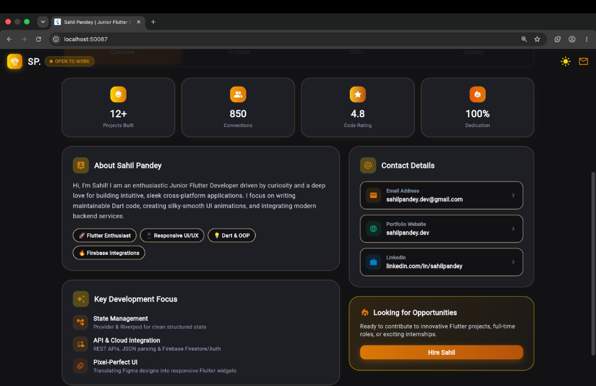
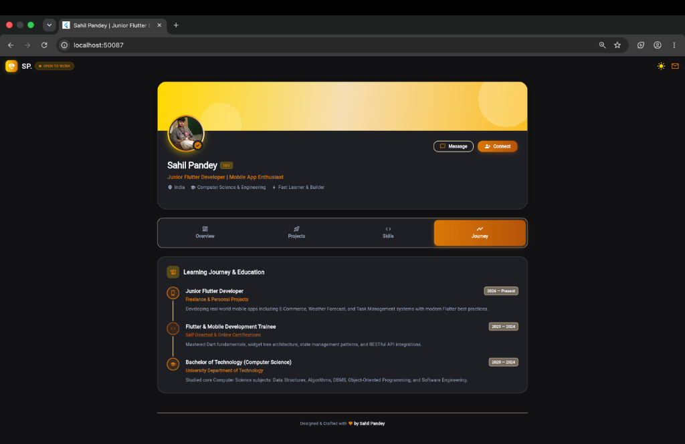

# 🚀 Sahil Pandey - Flutter Developer Portfolio & Profile App

[](https://flutter.dev)
[](https://dart.dev)
[](https://m3.material.io)
[](LICENSE)

An ultra-modern, responsive, and interactive **Flutter Developer Portfolio & Profile Card Web App** designed with a bespoke luxury **Gold & Wheat Palette** (`#FFD700`, `#F5DEB3`, `#F8F8FF`). 

Featuring dual-theme toggle (Light & Dark), animated interactive tabs, Bento Grid overview, project showcase cards, categorized skills progress indicators, and career milestones.

---

## 📸 Screenshots & UI Previews

### ☀️ Light Theme (Gold & Wheat Luxury Palette)
<p align="center">
  
</p>

---

### 🌙 Dark Theme & Bento Grid Overview
<p align="center">
  
  
</p>

---

### 🚀 Projects Showcase & Technical Skills
| 🚀 Projects Grid | ⚡ Technical Skills & Gauges |
|:---:|:---:|
|  |  |

---

### 💼 Learning & Career Journey Timeline
<p align="center">
  
</p>

---

## 🌟 Key Features

- **✨ Luxury Light & Dark Modes**: Instant one-click theme switcher with custom gold/amber glow.
- **📱 Fully Responsive Design**: Desktop multi-column grid, tablet adaptive bento layout, and mobile-friendly stacking.
- **🌟 Bento Grid Overview**: Key metrics (12+ Apps, 850 Connections, 4.8 Rating), biography, contact dock, and architectural focus.
- **🚀 Project Showcase Grid**: Interactive project cards (*QuickShop, SkyCast, TaskFlow, ChatSphere*) with tech stack pills and star ratings.
- **⚡ Categorized Skill Gauges**: Visual proficiency progress bars classified into Core Mobile, Backend/Cloud, and UI/UX Architecture.
- **💼 Learning & Career Journey**: Milestone-based vertical timeline with connecting lines and status badges.
- **🎯 Interactive Feedback**: One-tap email copy with floating toast, connect/following state counter, and send message dialog modal.

---

## 🎨 Design System & Color Palette

| Token | Hex Code | Purpose & Usage |
|---|---|---|
| **Gold** | `#FFD700` | Mesh gradient cover, glowing avatar ring, verified badge & active accents |
| **Deep Gold / Bronze** | `#D97706` / `#B45309` | High-contrast readable buttons, icons, highlights & active tab states |
| **Wheat** | `#F5DEB3` | Card borders, subtle pill badges, timeline connector lines & tab borders |
| **Ghost White** | `#F8F8FF` | Primary light theme background canvas & input fields |
| **Charcoal Surface** | `#121214` / `#1E1E24` | Midnight dark theme background & elevated surface cards |

---

## 🏗️ Project Architecture & Structure

```
profile_card/
├── assets/
│   ├── sahil_profile.jpg         # Profile image asset
│   └── profile.jpg               # Backup profile asset
├── screenshots/                  # High-resolution UI preview captures
│   ├── 01_overview_light.png
│   ├── 02_overview_dark.png
│   ├── 03_bento_details.png
│   ├── 04_projects_tab.png
│   ├── 05_skills_tab.png
│   └── 06_journey_tab.png
├── lib/
│   └── main.dart                 # Complete single-file clean architecture UI
├── web/
│   └── index.html                # Web entrypoint & metadata
├── pubspec.yaml                  # Dependencies, assets declaration
├── PROJECT_DOCUMENTATION.md      # In-depth technical architecture doc
└── README.md                     # Comprehensive documentation
```

### 🧩 Component Breakdown (`lib/main.dart`):

1. **`ModernProfileApp`**:
   - Root `MaterialApp` managing `ThemeMode.light` and `ThemeMode.dark`.
   - Defines custom light & dark `ThemeData` with customized Material 3 tokens.

2. **`ProfileHomeScreen`**:
   - `CustomScrollView` with pinned `SliverAppBar`.
   - Floating Glass Navbar with Brand Logo (`SP.`), **🟢 OPEN TO WORK** live indicator, and Theme Switcher.

3. **`_buildHeroCard`**:
   - Gradient mesh cover header.
   - Glowing circular avatar overlapping banner with verified checkmark badge.
   - Quick action buttons: **Message** (interactive dialog) and **Connect** (state toggle).

4. **`_buildTabSelector` & Tab Panels**:
   - **Tab 0 (`_buildOverviewTab`)**: 4 KPI Stat Cards + Bento Grid Layout (Bio, Contact Dock, Tech Focus, Hire Me card).
   - **Tab 1 (`_buildProjectsTab`)**: Responsive 2-column project cards with category badges and tech tags.
   - **Tab 2 (`_buildSkillsTab`)**: Categorized skill sections with percentage meters and level badges (*Expert, Advanced, Proficient*).
   - **Tab 3 (`_buildExperienceTab`)**: Vertical milestone timeline with connecting lines and date tags.

---

## 🛠️ Quick Start & Running Locally

### 1. Prerequisites
- **Flutter SDK**: `^3.9.0` or higher ([Install Guide](https://docs.flutter.dev/get-started/install))
- **Google Chrome** (for web development) or an iOS/Android Simulator.

### 2. Installation & Setup
```bash
# Clone or navigate to the repository
cd profile_card

# Install all packages & assets
flutter pub get
```

### 3. Run the Application

#### In Google Chrome (Web):
```bash
flutter run -d chrome
```

#### In macOS Desktop App:
```bash
flutter run -d macos
```

#### On Connected Mobile Device / Emulator:
```bash
flutter run
```

### 4. Build for Production Web
```bash
flutter build web --release
```
The production bundle will be generated in `build/web/` ready to be deployed to Firebase Hosting, Vercel, or any static web host.

---

## ⚙️ Customization Guide

### How to update your details:
Open `lib/main.dart` and modify the following constants and fields:
- **Name**: Edit `'Sahil Pandey'` in `_buildHeroCard`.
- **Email**: Update `userEmail = 'sahilpandey.dev@gmail.com'`.
- **Role/Bio**: Edit the bio string in `_buildAboutBento`.
- **Profile Image**: Replace `assets/sahil_profile.jpg` with your photo.
- **Projects**: Modify the `projects` list inside `_buildProjectsTab`.
- **Skills**: Add or adjust skill percentages in `_buildSkillsTab`.

---

## 📄 License
This project is open-source and available under the [MIT License](LICENSE).

---

Crafted with 💛 by **Sahil Pandey**
