# 🚀 Dart & Flutter Assignments Master Portfolio

[](https://flutter.dev)
[](https://dart.dev)
[](https://m3.material.io)
[](LICENSE)

> A curated collection of **Dart & Flutter projects and assignments** demonstrating core language fundamentals, object-oriented clean code architecture, sound null safety, asynchronous processing, reactive state management, and production-grade responsive UI/UX designs.

**Author:** [Sahil Pandey](https://github.com/Sahilp2407)  
**Track:** Dart & Flutter Mobile Application Development

---

## 📑 Table of Contents

- [Overview & Roadmap](#-overview--roadmap)
- [Project Directory & Summaries](#-project-directory--summaries)
  - [1. Assignment 1: Marvel Universe Archives & Library Management](#1--assignment-1-marvel-universe-archives--library-management)
  - [2. Assignment 2: Null-Safe Async Data Fetcher](#2--assignment-2-null-safe-async-data-fetcher)
  - [3. Assignment 3: Luxury Flutter Developer Portfolio & Profile App](#3--assignment-3-luxury-flutter-developer-portfolio--profile-app)
  - [4. Assignment 5: TaskFlow — Executive Todo List Application](#4--assignment-5-taskflow--executive-todo-list-application)
  - [5. Assignment 6: LUXE MART — Dynamic Product Catalog & E-Commerce App](#5--assignment-6-luxe-mart--dynamic-product-catalog--e-commerce-app)
- [🛠️ Tech Stack & Skills Matrix](#️-tech-stack--skills-matrix)
- [💻 Getting Started & Execution Guide](#-getting-started--execution-guide)
  - [Prerequisites](#prerequisites)
  - [Running Dart Scripts](#running-dart-scripts)
  - [Running Flutter Applications](#running-flutter-applications)
- [📂 Repository Structure](#-repository-structure)

---

## 🧭 Overview & Roadmap

This repository represents progressive milestones in mobile software engineering with Dart and Flutter — evolving from foundational OOP CLI programs to high-end responsive Flutter applications:

```
┌──────────────────────────┐        ┌──────────────────────────┐
│       Assignment 1       │───────>│       Assignment 2       │
│  Dart Basics & OOP Core  │        │ Async, Futures & Safety  │
└──────────────────────────┘        └──────────────────────────┘
             │                                   │
             ▼                                   ▼
┌──────────────────────────┐        ┌──────────────────────────┐
│       Assignment 3       │───────>│       Assignment 5       │
│   Responsive Profile UI  │        │ TaskFlow (setState Arch) │
└──────────────────────────┘        └──────────────────────────┘
                                                 │
                                                 ▼
                                    ┌──────────────────────────┐
                                    │       Assignment 6       │
                                    │ LUXE MART (E-Commerce)   │
                                    └──────────────────────────┘
```

---

## 📦 Project Directory & Summaries

---

### 1. 📚 Assignment 1: Marvel Universe Archives & Library Management
> **Folder:** [`Assignment-1-Dart-Basics-Script/`](./Assignment-1-Dart-Basics-Script)  
> **Type:** Console Application / Dart CLI  
> **Key Topics:** Object-Oriented Programming (OOP), Polymorphism, Clean Architecture, Encapsulation

#### 📖 Description
A modular, console-based Library Catalog Management System implemented in **Dart 3.x** themed around the Marvel Universe. It demonstrates clean domain separation, strict typing, and practical OOP design patterns.

#### ✨ Core Highlights
- **Polymorphic Architecture**: Abstract base class (`CatalogItem`) extended by concrete models (`BookItem`, `PeriodicalItem`).
- **Catalog Operations**: Dynamic item registration, keyword search, and availability checks.
- **Patron & Loan System**: Real-time borrower records and portfolio tracking.
- **Transaction Engine**: Double-checkout prevention and return processing.
- **Fine Calculation Utility**: Overdue penalty calculation engine with configurable daily rates.

#### 🚀 How to Run
```bash
cd Assignment-1-Dart-Basics-Script
dart run lib/main.dart
```

---

### 2. ⚡ Assignment 2: Null-Safe Async Data Fetcher
> **Folder:** [`Assignment-2-Null-Safe-Async-Fetcher/`](./Assignment-2-Null-Safe-Async-Fetcher)  
> **Type:** Asynchronous Dart Script  
> **Key Topics:** `Future`, `async/await`, Sound Null Safety, Exception Handling (`try-catch`)

#### 📖 Description
Implements an asynchronous, null-safe data fetcher simulating real-world network latency and API consumer operations. It shows how modern Dart handles non-blocking execution while safely managing missing data (`null`) and runtime faults.

#### ✨ Core Highlights
- **Asynchronous Execution**: Network latency simulation using `Future.delayed(Duration(seconds: 1))` without blocking the event loop.
- **Sound Null Safety**: Uses `Future<String?>` to safely express optional records and eliminates runtime null reference errors.
- **Defensive Error Handling**: Input validation (`userId <= 0`) with custom exceptions and graceful recovery via `try-catch`.
- **Verification Matrix**: Fully covered by test cases for valid IDs, not-found conditions, and invalid inputs.

#### 🚀 How to Run
```bash
cd Assignment-2-Null-Safe-Async-Fetcher
dart run main.dart
```

---

### 3. 💎 Assignment 3: Luxury Flutter Developer Portfolio & Profile App
> **Folder:** [`Assignment-3-Profile-Card-UI/`](./Assignment-3-Profile-Card-UI)  
> **Type:** Cross-Platform Flutter App (Web, macOS, iOS, Android)  
> **Key Topics:** Responsive Layout, Custom Theme Engine, Bento Grid, Slivers, Micro-interactions

#### 📖 Description
An ultra-modern, responsive Flutter developer portfolio and profile web app featuring a custom **Luxury Gold & Wheat Palette** (`#FFD700`, `#F5DEB3`, `#F8F8FF`). Built to deliver a desktop-class experience with smooth theme toggles, animated tabs, and interactive elements.

#### 📸 UI Preview
| ☀️ Light Theme (Gold & Wheat) | 🌙 Dark Theme (Bento Overview) |
|:---:|:---:|
| 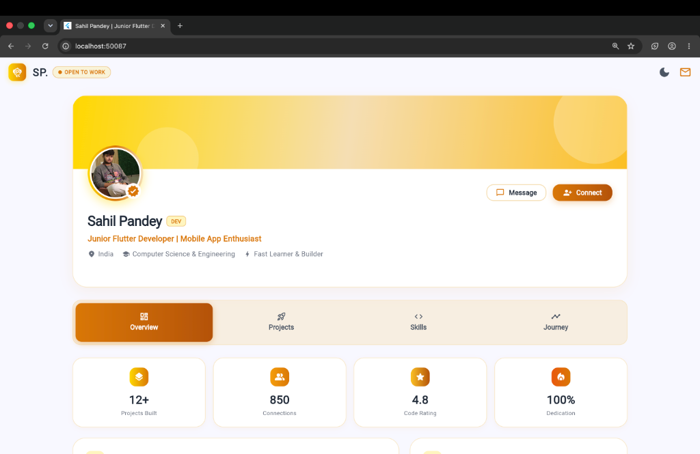 | 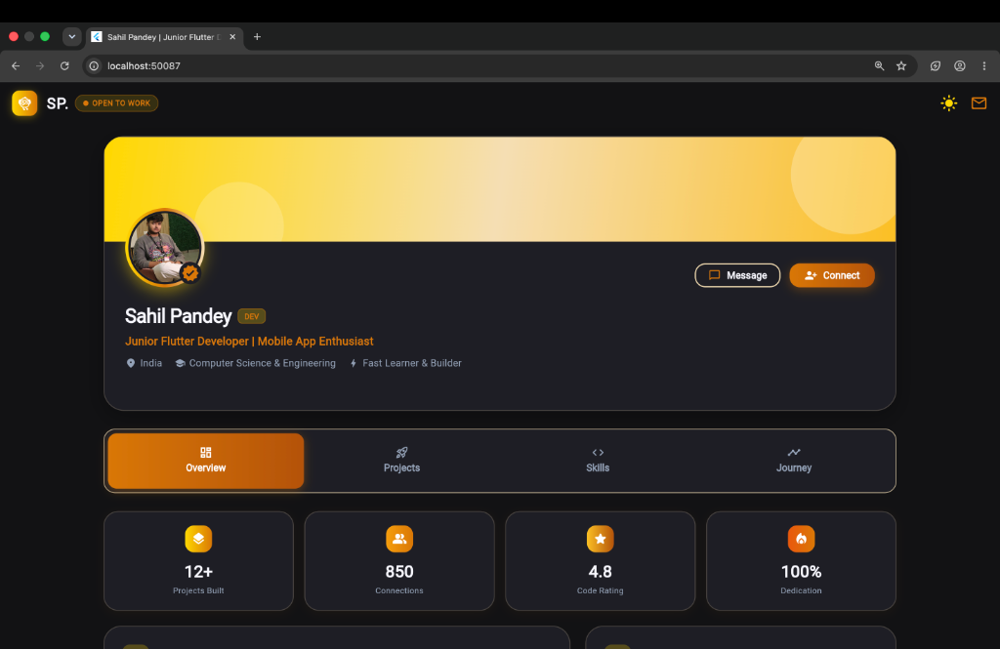 |

| 🚀 Projects Showcase Grid | ⚡ Technical Skill Gauges |
|:---:|:---:|
| 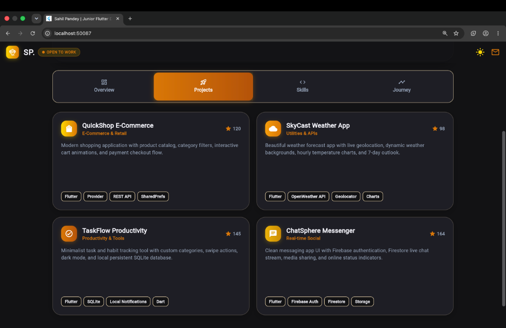 | 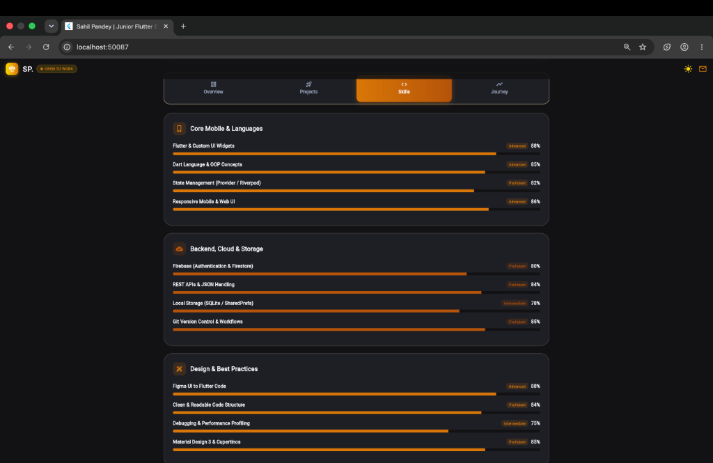 |

#### ✨ Core Highlights
- **Custom Dual-Theme Engine**: One-tap toggle between Ghost White Luxury Light Mode and Obsidian Dark Mode.
- **Adaptive Responsive Layout**: Multi-column desktop grid, tablet bento layout, and mobile-optimized viewports.
- **Bento Grid Overview**: Live availability badge (**🟢 OPEN TO WORK**), key stats, social dock, and quick actions.
- **Project Showcase & Skill Indicators**: Categorized progress indicators across Mobile, Backend, and UI architecture.
- **Interactive Modals & Feedback**: Clipboard toast feedback, connection counter, and contact dialog.

#### 🚀 How to Run
```bash
cd Assignment-3-Profile-Card-UI
flutter pub get
flutter run -d chrome
```

---

### 4. 📝 Assignment 5: TaskFlow — Executive Todo List Application
> **Folder:** [`Assignment-5-Todo-List-App-with-State/`](./Assignment-5-Todo-List-App-with-State)  
> **Type:** Cross-Platform Flutter App  
> **Key Topics:** Native State Management (`StatefulWidget` & `setState()`), Animation Controllers, Input Validation

#### 📖 Description
A clean, modern, and executive Todo List application focusing on native Flutter state management principles. It demonstrates state mutations without external state libraries, combining fluid micro-animations with an Obsidian & Gold executive dark theme.

#### 📸 UI Preview
| 💫 Animated Luxury Splash Screen | 📋 Executive Dark Todo UI |
|:---:|:---:|
| 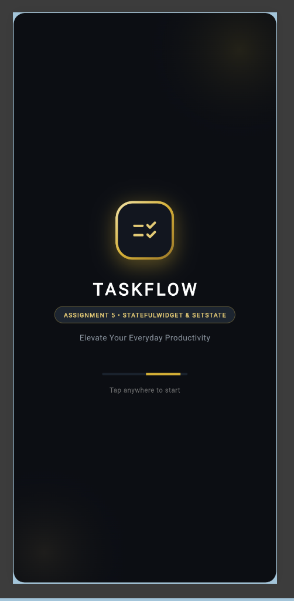 | 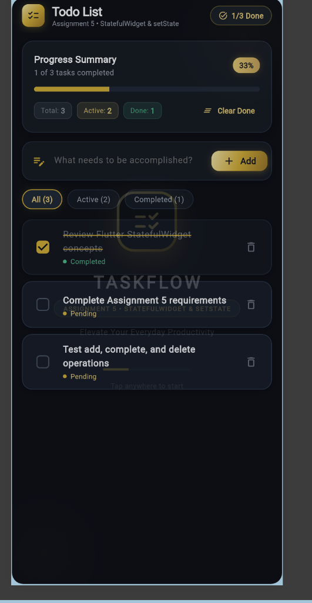 |

#### ✨ Core Highlights
- **Pure Native State Management**: Strictly implements `setState()` for task creation, toggling, filtering, and deletion.
- **Executive Dark Aesthetic**: Obsidian canvas (`#0B0E14`), elevated cards (`#151A22`), and warm radiant gold accents (`#D4AF37`).
- **Dynamic Progress Card**: Real-time counter showing completed vs. total tasks with a glowing linear gauge.
- **Delete with Instant Undo**: Dismissible task cards and delete actions with a floating SnackBar `UNDO` handler.
- **Segmented Filter Tabs**: Filter items dynamically across *All*, *Active*, and *Completed* views.
- **Automated Test Suite**: 7 comprehensive widget tests verifying all state transitions.

#### 🚀 How to Run
```bash
cd Assignment-5-Todo-List-App-with-State
flutter pub get
flutter run -d chrome
# Run automated tests:
flutter test
```

---

### 5. 🛍️ Assignment 6: LUXE MART — Dynamic Product Catalog & E-Commerce App
> **Folder:** [`Assignment-6-Dynamic-Product-Catalog/`](./Assignment-6-Dynamic-Product-Catalog)  
> **Type:** Full-featured Mobile & Web E-Commerce Application  
> **Key Topics:** Dynamic Builders (`ListView.builder`), Real-time Search & Multi-filter, Hero Animations, Cart & Wishlist

#### 📖 Description
A luxury, Gen-Z e-commerce mobile application showcasing dynamic list rendering, multi-criteria reactive filtering, interactive shopping cart calculations, persistent wishlist state, and seamless navigation with Hero transitions.

#### 📸 UI Preview
| 01. Splash Screen | 02. Catalog & Search | 03. Wishlist |
| :---:|:---:|:---:|
| 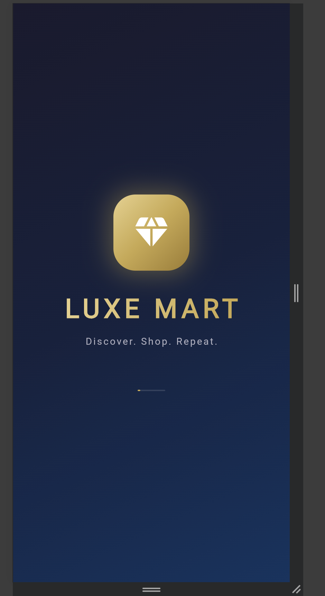 | 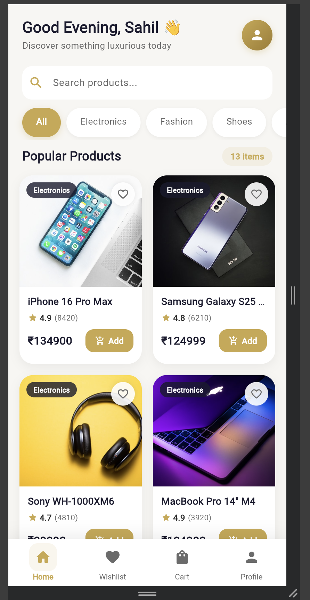 | 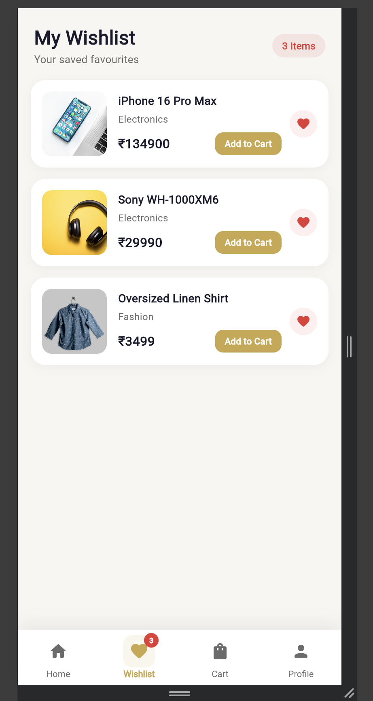 |

| 04. Cart & Live Calculations | 05. Customer Profile |
| :---:|:---:|
| 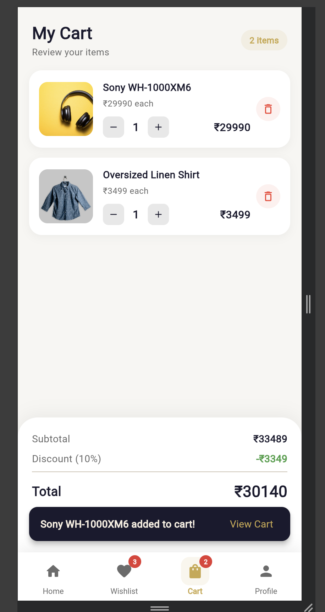 | 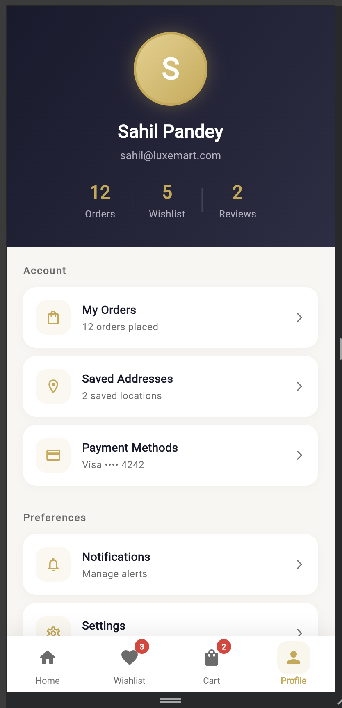 |

#### ✨ Core Highlights
- **Dynamic List & Grid Rendering**: Efficient item rendering using `ListView.builder` and `SliverGrid.builder`.
- **Real-Time Combined Search & Filter**: Instant `TextField` search combined via logical **AND** with category pill chips (*Electronics, Fashion, Shoes, Accessories, Beauty*).
- **Hero Transitions**: Smooth image elevation transitions moving from product cards to detailed views.
- **Interactive Cart System**: Quantity steppers (`+`/`-`), live item subtotal calculation, 10% promo discount, and grand total checkout.
- **Wishlist & Synchronized Badges**: Instant toggle of favorites reflected immediately across the bottom navigation counter badge.
- **Customer Dashboard**: Profile overview displaying recent orders, addresses, and account metrics.

#### 🚀 How to Run
```bash
cd Assignment-6-Dynamic-Product-Catalog
flutter pub get
flutter run -d chrome
# Run tests:
flutter test
```

---

## 🛠️ Tech Stack & Skills Matrix

| Capability / Concept | Assignment 1 | Assignment 2 | Assignment 3 | Assignment 5 | Assignment 6 |
|:---|:---:|:---:|:---:|:---:|:---:|
| **Dart 3.x Fundamentals** | ✅ | ✅ | ✅ | ✅ | ✅ |
| **Object-Oriented Design (OOP)** | ✅ | ✅ | ✅ | ✅ | ✅ |
| **Sound Null Safety** | ✅ | ✅ | ✅ | ✅ | ✅ |
| **Asynchronous & Futures** | — | ✅ | — | ✅ | ✅ |
| **Exception Handling & Validation** | ✅ | ✅ | — | ✅ | ✅ |
| **Flutter Material Design 3** | — | — | ✅ | ✅ | ✅ |
| **Custom Theming (Light/Dark)** | — | — | ✅ | ✅ | ✅ |
| **Native State Management (`setState`)** | — | — | ✅ | ✅ | ✅ |
| **Dynamic Builders (`ListView.builder`)** | — | — | — | ✅ | ✅ |
| **Hero Transitions & Animations** | — | — | ✅ | ✅ | ✅ |
| **Widget & Unit Testing** | — | — | ✅ | ✅ | ✅ |

---

## 💻 Getting Started & Execution Guide

### Prerequisites
- [Flutter SDK](https://flutter.dev/docs/get-started/install) (`v3.24` or higher recommended)
- [Dart SDK](https://dart.dev/get-dart) (`v3.0` or higher)
- Chrome Browser (for web execution) or an active Android / iOS emulator / macOS desktop target

### Clone Repository
```bash
git clone https://github.com/Sahilp2407/Flutter-assignment-.git
cd Flutter-assignment-
```

### Running Dart Scripts
```bash
# Run Assignment 1
dart run Assignment-1-Dart-Basics-Script/lib/main.dart

# Run Assignment 2
dart run Assignment-2-Null-Safe-Async-Fetcher/main.dart
```

### Running Flutter Applications
```bash
# Choose any Flutter assignment:
cd Assignment-3-Profile-Card-UI
# or cd Assignment-5-Todo-List-App-with-State
# or cd Assignment-6-Dynamic-Product-Catalog

# Fetch packages
flutter pub get

# Launch on Web Chrome
flutter run -d chrome

# Launch on macOS Desktop (if supported)
flutter run -d macos
```

---

## 📂 Repository Structure

```
assignments/
├── README.md                                    # Master documentation (this file)
│
├── Assignment-1-Dart-Basics-Script/             # CLI Library Management System
│   ├── lib/                                     # OOP Models & Services
│   ├── DOCUMENTATION.docx                       # Submission Report
│   └── README.md
│
├── Assignment-2-Null-Safe-Async-Fetcher/        # Async & Null Safety Demo
│   ├── main.dart                                # Async fetcher implementation
│   ├── ASSIGNMENT_DOCUMENTATION.md              # Test matrix & documentation
│   └── README.md
│
├── Assignment-3-Profile-Card-UI/                # Luxury Profile Portfolio Web App
│   ├── lib/main.dart                            # Responsive dual-theme UI
│   ├── screenshots/                             # High-res UI preview captures
│   ├── PROJECT_DOCUMENTATION.md                 # Architecture documentation
│   └── README.md
│
├── Assignment-5-Todo-List-App-with-State/       # TaskFlow Executive Todo App
│   ├── lib/                                     # Models, screens & native state
│   ├── assets/screenshots/                      # App captures
│   ├── test/                                    # 7 automated tests
│   └── README.md
│
└── Assignment-6-Dynamic-Product-Catalog/        # LUXE MART E-Commerce App
    ├── lib/                                     # Models, screens, theme, widgets
    ├── screenshots/                             # Catalog, cart, wishlist captures
    ├── test/                                    # Catalog widget tests
    └── README.md
```

---

## 👨‍💻 Author

**Sahil Pandey**  
- **GitHub:** [@Sahilp2407](https://github.com/Sahilp2407)  
- **Specialization:** Flutter & Dart Cross-Platform Mobile Engineering  

---

<p align="center">
  Crafted with ❤️ and precision using <b>Flutter & Dart</b>
</p>
